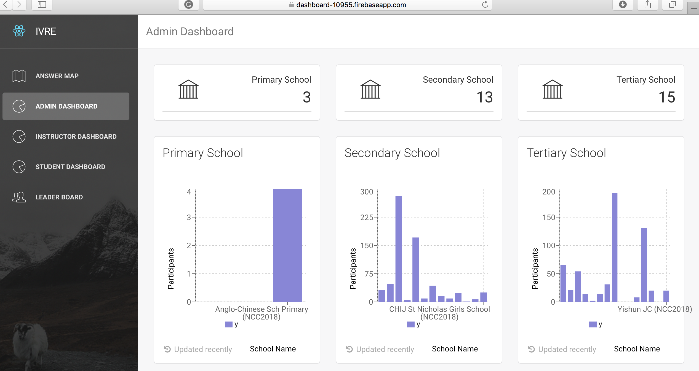

# [IVRE](https://dashboard-10955.firebaseapp.com/)
# BT3103 AY17/18 | Group 9

**[IVRE](https://dashboard-10955.firebaseapp.com/)** Integrated Virtual Reviewing Environment (IVRE) serves as a platform for students and instructors to review their educational progress and for administrators from either Achievement app or CodeCombat to evaluate the overall usage of their app. Our product strives to enhance students’ learning experience and ensure that no student is lack behind. Bundled with CodeCombat, instructors will be able to oversee their students’ holistic performances. On IVRE, students will also be able to gauge their individual performance.

IVRE has two main goals that it wishes to achieve. Firstly, it aims to provide a dashboard for instructors and the administrators. A dashboard that gives concrete reviews and updates about their students’ performance and provides valuable insights from how students’ performance in CodeCombat. Secondly, IVRE lets students gauge their personal performance compared to their peers. There will be individual CodeCombat profile and a leaderboard that features the top 20 students in the course. 

## Links:

+ [Live Preview](https://dashboard-10955.firebaseapp.com/)
+ [Youtube Video]()
+ [Notebook](https://colab.research.google.com/drive/1bH-td7R2Ic7U3FpAMYkIkEaSM64n3Uhq)

## UserGuide:

### Answer Map:
IVRE also let instructors and students to get an overview of open ended QnA. 
With the help of a WordMap, a summary of students’ answers for the assignment can be seen. 
For example, in the BT3103 assignments, the instructor has asked students to give the topics (usually, one worded) mentioned in the video. With WordMap, this can be analysed easily.

### Administrator:
A dashboard that oversees all performance, providing demographics and essential information of each course or cohort. 
It aims to help admin team to facilitate the revise of the design of application and the curriculum for codecombat.

1. The overall picture of distribution of participants in the three cohorts：In this case, it can easily be identified that primary stream is the potential target to expand the usage. Relevant campaigns can be organised to promote codecombat to the primary school students.
2. Number of participants of each school in each cohort.
3. An overview of user distributions among all courses.
4. Average playtime in each course last week: This chart is to gauge the overall usage of CodeCombat. For example,it is the most commonly & frequently used in NUSHS-senior while some schools have yet started the use of CodeCombat such as Jurong JC (there is course but playtime=0)
5. Admin users can also zoom into one particular course to see more detailed usage information. Here we use Duman High School-junior as example for sake of demonstration. It shows the average playtime of students in the course over the past 6 weeks. The stats shows an pleasing increase in the average playtime -> our promotion in DHS-junior has been successful
6. Bar chart showing admin users the hardest 20 levels in CodeCombat based on the average time spent by the users to complete. As shown, level “blind distance” roughly takes users around one hour to complete compared to the rest of the levels which vary within 30mins. This shows that “blind distance” may be too demanding and helps the admin team to reflect on the difficulty of each level  and revise the syllabus of codecombat accordingly. 

### Instructor:
As a instructor, what the user cares the most is how his students are doing with their academics currently, what he can help them if they meet any problems, and how he can improve on the curriculum that the school is delivering to the students. 

By clicking on the Instructor Dahboard button in the sidebar, there are 5 charts shown on the screen.
1. Top 20 Level being completed by most students: By looking at the top 20 levels being completed by most students, the instructor is able to evaluate on the learning progess of this cohort of students and examine on the difficulty level of the course as well. 
2. Top 10 most and least active students in the course: These 2 charts help the instructor to know who are the most and least active students in the course, based on the number of actions they took last week. For the least active students, instructors might be insterested to find out why they are not actively participating in the course and help them accordingly. However, being the most active students does not mean they are the ones who finished the most number of levels. 
3. 10 students with the highest average number of attempts: This chart shows that this group of students attempted the most number of times per level. It would be very useful for the instructor to examine on the reasons why they attempted so many times and help them accordingly.
4. Learning curve of a particular student: The instructor is allowed to zoom into one particular student's learning curve, which is the number of actions per week and plotted in a line chart.

### Student: 
For student to gauge their personal performance among their peers
1. An overview of the profile: The overview shows the name of the student, the number of levels the student user has been completed and his or her current rank in the course. 
2. Participation summary which has been optimised from our first version. Originally it only showed the number of level completed in each week. Currently, it shows the the playtime user spent and average playtime in the course in each week. This shows a more direct comparison to see how active the user is relatively to his fellow peers in the same course

### Leaderboard: 
A dashboard which can be accessed by both instructors and students. 
It shows the top 20 students with highest number of levels completed. 

